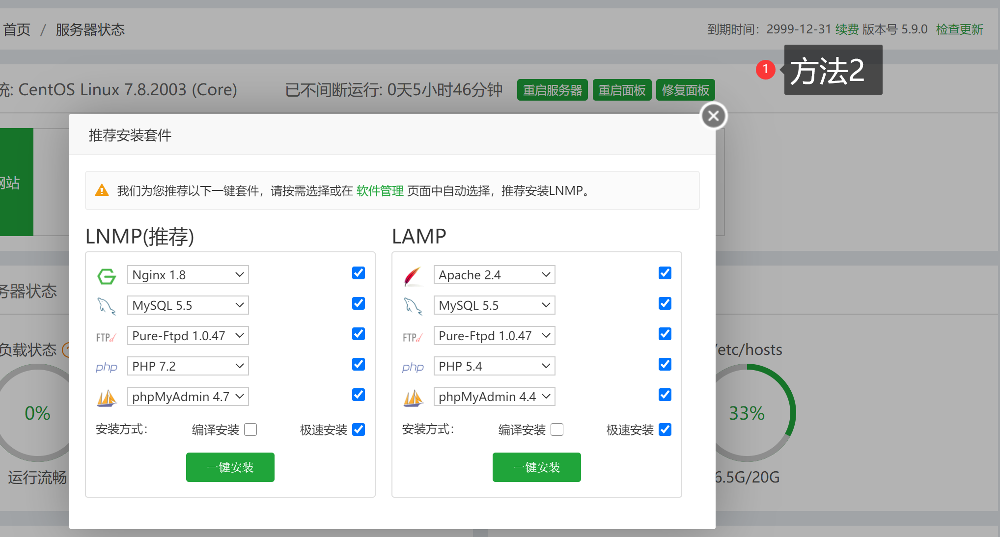

# 宝塔5.9.x完整开心

Created By: Eicky 
Last Edited: Sep 24, 2020 10:41 AM

## 方法1

### 安装宝塔

```jsx
CentOS
yum install -y wget && wget -O install.sh http://download.bt.cn/install/install.sh && echo y | sh install.sh

Debian/Ubuntu
wget -O [install.sh](http://install.sh/) [http://download.bt.cn/install/install-ubuntu.sh](http://download.bt.cn/install/install-ubuntu.sh) && sudo bash [install.sh](http://install.sh/)

```

### 升级到专业版

```jsx
wget -O update.sh http://download.bt.cn/install/update_pro.sh && bash update.sh pro
```

### 开心

```jsx
>/www/server/panel/data/userInfo.json
/etc/init.d/bt restart
```

就这样就可以装付费插件了，到期时间显示当天



## 方法2

### 安装bt5.9

```bash
yum install -y wget && wget -O install.sh http://download.bt.cn/install/install.sh && echo y | sh install.sh
```

### 升级到专业版

```bash
wget -O update.sh http://download.bt.cn/install/update_pro.sh && bash update.sh pro
```

### 替换`common.py`

```bash
cd /www/server && cp -r panel panel-bak
wget http://download.bt.cn/install/update/LinuxPanel-5.9.0_pro.zip
unzip -o LinuxPanel-5.9.0_pro.zip panel/class/common.py
rm -f LinuxPanel-5.9.0_pro.zip
```

### 开心

```jsx
sed -i "s/data = panelAuth.panelAuth().get_order_status(None);/data = {'status' : True,'msg' : {'endtime' : 32503651199 }};/" /www/server/panel/class/common.py
>/www/server/panel/data/userInfo.json
/etc/init.d/bt restart
```

这样的话，就是显示2099年到期了


---

不管你用不用的上，建议把这几个老版本下载保存一份

### 脚本

```bash
http://download.bt.cn/install/install.sh
[http://download.bt.cn/install/install-ubuntu.sh](http://download.bt.cn/install/install-ubuntu.sh)
http://download.bt.cn/install/update_pro.sh
```

### 面板文件

```bash
http://download.bt.cn/install/update/LinuxPanel-5.9.0.zip
http://download.bt.cn/install/update/LinuxPanel-5.9.1.zip
http://download.bt.cn/install/update/LinuxPanel-5.9.2.zip
http://download.bt.cn/install/update/LinuxPanel-5.9.0_pro.zip
http://download.bt.cn/install/update/LinuxPanel-5.9.1_pro.zip
http://download.bt.cn/install/update/LinuxPanel-5.9.2_pro.zip
```

主要是安装脚本和5.9.0和5.9.2这三个

```bash
http://download.bt.cn/install/install.sh
http://download.bt.cn/install/update/LinuxPanel-5.9.0_pro.zip
http://download.bt.cn/install/update/LinuxPanel-5.9.2_pro.zip
```

---

### 一键脚本

```bash
#确保有wget和unzip
yum install -y wget unzip

apt install -y wget unzip
```

### 方法1

```bash
#以下代码一起复制粘贴回车
CentOS
yum install -y wget && wget -O install.sh http://download.bt.cn/install/install.sh && echo y | sh install.sh && \
wget -O update.sh http://download.bt.cn/install/update_pro.sh && bash update.sh pro && \
>/www/server/panel/data/userInfo.json && \
/etc/init.d/bt restart && /etc/init.d/bt default

Debian/Ubuntu
apt-get install -y wget && wget -O install.sh http://download.bt.cn/install/install-ubuntu.sh && echo y | sh install.sh && \
wget -O update.sh http://download.bt.cn/install/update_pro.sh && bash update.sh pro && \
>/www/server/panel/data/userInfo.json && \
/etc/init.d/bt restart && /etc/init.d/bt default
```

### 方法2

```bash
#以下代码一起复制粘贴回车
CentOS
wget -O install.sh http://download.bt.cn/install/install.sh && echo y | sh install.sh && \
wget -O update.sh http://download.bt.cn/install/update_pro.sh && bash update.sh pro && \
cd /www/server && cp -r panel panel-bak && \
wget http://download.bt.cn/install/update/LinuxPanel-5.9.0_pro.zip && \
unzip -o LinuxPanel-5.9.0_pro.zip panel/class/common.py && rm -f LinuxPanel-5.9.0_pro.zip && \
sed -i "s/data = panelAuth.panelAuth().get_order_status(None);/data = {'status' : True,'msg' : {'endtime' : 32503651199 }};/" /www/server/panel/class/common.py && \
>/www/server/panel/data/userInfo.json && \
/etc/init.d/bt restart && /etc/init.d/bt default

Debian/Ubuntu
wget -O install.sh http://download.bt.cn/install/install-ubuntu.sh && echo y | sh install.sh && \
wget -O update.sh http://download.bt.cn/install/update_pro.sh && bash update.sh pro && \
cd /www/server && cp -r panel panel-bak && \
wget http://download.bt.cn/install/update/LinuxPanel-5.9.0_pro.zip && \
unzip -o LinuxPanel-5.9.0_pro.zip panel/class/common.py && rm -f LinuxPanel-5.9.0_pro.zip && \
sed -i "s/data = panelAuth.panelAuth().get_order_status(None);/data = {'status' : True,'msg' : {'endtime' : 32503651199 }};/" /www/server/panel/class/common.py && \
>/www/server/panel/data/userInfo.json && \
/etc/init.d/bt restart && /etc/init.d/bt default
```

---

### 题外话

Q: `5.x的版本听说lnmp的版本都很老`

W:

```bash
安装脚本好像是在线的，5.9.2面板上显示最高是1.18，实际上安装脚本和7.x应该是同一个，也就是7.x能装啥5.x也能装啥，只是要到终端用命令装，应该是这样
bash /www/server/panel/install/nginx.sh install 1.19
```

---

## 宝塔Linux面板命令大全

[宝塔linux面板命令大全 - 宝塔面板](https://www.bt.cn/btcode.html)
